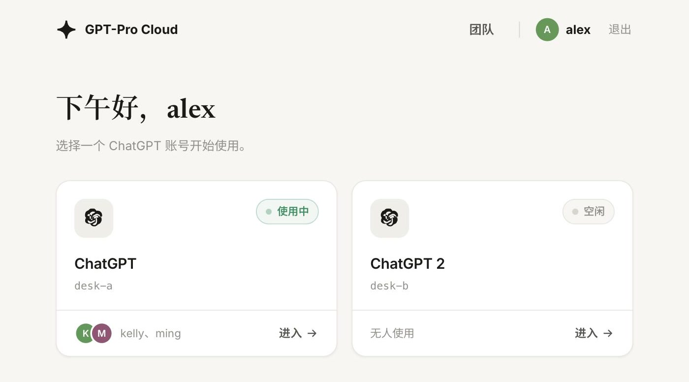

<div align="center">


# GPT-Pro Cloud — One Pro seat, every device on the team.

[](docker-compose.yml)
[](gateway/)
[](docker/)
[](https://kasmweb.com/kasmvnc)
[](Deploy.md)
[](LICENSE)

**English** | [简体中文](README.zh-CN.md)

</div>

---

GPT-Pro Cloud is a Docker gateway and browser desktop for running signed-in ChatGPT sessions on a machine you control. It is for individuals and small teams that need one Pro seat reachable from every device, with no client to install and no second login.

> **Disclaimer** — sharing a ChatGPT account between people may violate OpenAI's terms and policies. This repository only provides a self-hosting mechanism; whether and how you use it, and all consequences, are your own responsibility and unrelated to this repository.



Each account gets its own Chromium with a persistent profile. One gateway serves the login, the account picker, team management and the remote desktop — entirely in the browser.

## Install

Runs on Docker Compose (a Linux server; Docker Desktop on macOS or Windows), roughly 1 GB of RAM per account.

```bash
git clone https://github.com/JingxuanKang/GPT-Pro-Cloud.git
cd GPT-Pro-Cloud
cp .env.example .env
./scripts/up.sh
```

Private access: a LAN or a VPN such as Tailscale (plain HTTP). Public access: a Cloudflare Tunnel after the administrator exists — [Public access](#public-access).

## Quick start

Open `http://127.0.0.1:36090` (or the LAN / VPN host) — the first visit walks you through creating the administrator account (or pre-seed it with `AUTH_PASSWORD` in `.env` for automated deployments). Then open each account card once and log in to ChatGPT inside it; the profile survives restarts, so this is a one-time step per account.

After that, any device on the same private network opens the same URL and lands in the signed-in session. Finish the administrator on localhost or the LAN before starting a public tunnel — otherwise a stranger who opens the public URL could claim admin.

## Public access

HTTPS on the open internet is a Cloudflare Tunnel. The administrator must already exist (wizard or `AUTH_PASSWORD`) before the tunnel goes up. Opening the public URL must be the login page, not the first-visit wizard.

Set `BIND_ADDR=127.0.0.1` in `.env` so the panel is not also published as plain HTTP on a public NIC, then:

```bash
# quick tunnel: no domain required
cloudflared tunnel --url http://127.0.0.1:36090
```

Share the `https://` URL it prints. You sign in with the administrator you already created. Members use the gateway username and password from the Team page — not ChatGPT passwords.

For a stable hostname, point a named tunnel at the same local port (that needs a domain on Cloudflare).

## Add an account

One ChatGPT account is one desktop container. The administrator adds one from the home page: **Add ChatGPT account**, give it a name, and a new card appears. Open it and log in to ChatGPT once — same as `a` / `b`.

The gateway clones the `desktop-a` image onto the compose network via the Docker Engine API (`desktop-<id>` DNS, volume `./data/<id>:/config`). Extra desks are stored in `data-panel/users.json` and their containers use `restart: unless-stopped`, so they survive a gateway restart without editing `INSTANCES` or `docker-compose.yml`.

One-time host setup: `docker-compose.yml` mounts `/var/run/docker.sock` into the gateway. After pulling this change, run `docker compose up -d` once so the mount is applied. Then adding a desk is a panel action — do not SSH in to copy compose services as the happy path.

`INSTANCES` and the `desktop-a` / `desktop-b` services stay as the built-in seats. Do not remove them; new desks are cloned from `desktop-a`.

A Cloud / CI VM that does not run the desktop image cannot prove a live Chromium. On a real Docker host (phoenix) verify: add a desk in the UI, `docker ps` shows `gpt-pro-cloud-<id>`, open the card, and complete the ChatGPT login.

## Team access

Members are managed on the **Team** page, which only the administrator sees.

| Goal | How |
| --- | --- |
| Add a member | Invite them, then assign which accounts they may open |
| Rotate a credential | Reset that member's password; their sessions are revoked |
| Remove access | Disable or delete the member; live sessions drop immediately |
| See who is using what | Machine cards show live presence per account; Team lists occupancy as information |
| Disconnect a live seat | On a live account card, **断开** revokes that member's login and drops the desktop; they sign in again. The member stays |

Passwords are stored as per-user salted scrypt hashes. Sign-in is rate limited per `ip|username` (10 attempts per 15 minutes), and sessions survive a restart.

## Clipboard

The clipboard is two-way and uses the shortcuts you already know — copy on your laptop, paste into the remote Chromium, and back. Text and screenshots both work.

## Sharing and memory isolation

There are two ways to share a chat. The basic path needs no automation: click ChatGPT's own Share inside the page and copy — the link reaches your local clipboard through the clipboard relay. With **page assist** on, the top bar gains a Share button that the gateway clicks for you, handing you the link directly.

Memory isolation is what makes one account usable by several people without shared context: with page assist on, the first time a member enters an account, the gateway creates (or reopens) a ChatGPT project named after them, set to **project-only memory**. Chats inside it neither read nor write the account's global memory, members don't leak context to each other, and each member's chats stay grouped in their own project.

Page assist is off by default. It drives chatgpt.com through DevTools selectors, so it can break when OpenAI redesigns the page; with it off you click Share yourself — links still reach your clipboard — and no project onboarding happens.

## Configuration

Everything lives in `.env` — the commented [`.env.example`](.env.example) is the reference.

| Setting | Purpose |
| --- | --- |
| `AUTH_PASSWORD` | Optional: pre-seed the administrator password; leave empty to use the first-visit wizard |
| `INSTANCES` | Built-in compose seats (`a,b`). Extra desks are added in the panel |
| `BIND_ADDR` | Address the gateway publishes on; `127.0.0.1` when tunneling, LAN or VPN address on a private network |
| `PROXY_URL_A`, `PROXY_URL_B` | Default per-account proxy; Settings (per desk or Apply to all) take precedence and apply immediately |
| `PROXY_URL` | Default proxy shared by every account |

A proxy is only needed when the server cannot reach ChatGPT directly (for example, hosts in mainland China); leave it empty otherwise. The prerequisite is an `http://` / `https://` / `socks5://` endpoint reachable from the server — for a proxy client running on the host, a loopback address like `http://127.0.0.1:7890` works and is rewritten to a container-reachable one automatically.

On **Settings**, **Apply to all** writes the same address to every ChatGPT desk and pushes it live the same way as saving one row (clipd / `--proxy-server`, Chromium restarts). Addresses you have saved stay as chips so you can pick one again without retyping.

## Architecture

```
browser ──▶ gateway (:36090) ──▶ desktop-a / desktop-b / extra desks
            login · picker · team    Chromium --kiosk chatgpt.com
```

The gateway is the only published port. VNC and Chromium DevTools stay on the container network and are unreachable from outside. State lives in `./data/` (Chromium profiles) and `./data-panel/` (members, sessions, settings); both are git-ignored and never leave the host.

## Security

The panel speaks plain HTTP. Everything, including the sign-in password, travels unencrypted, so direct access is only for a LAN or a VPN. Public access is HTTPS via Cloudflare Tunnel — see [Public access](#public-access). When tunneling, set `BIND_ADDR=127.0.0.1`; on a private network on a public-IP host, bind the LAN or VPN address — never `0.0.0.0` on a public NIC.

The setup wizard only appears while no administrator exists. Finish it on localhost or the LAN, or pre-seed with `AUTH_PASSWORD`, before starting the tunnel.

Rate limits and audit logs trust `CF-Connecting-IP` for requests that arrive through the tunnel.

## Development

```bash
docker compose up -d --build
docker compose logs -f gateway
```

The gateway is Node 22 with no build step. `docker/` holds the desktop image with a pinned Chromium version — bump it there, not at runtime. [Deploy.md](Deploy.md) covers rollout, rollback, health checks and log locations.

## License

MIT. See [LICENSE](LICENSE). Built on [KasmVNC](https://kasmweb.com/kasmvnc) and the [LinuxServer.io](https://www.linuxserver.io/) base image. Not affiliated with OpenAI; ChatGPT is a trademark of OpenAI.
